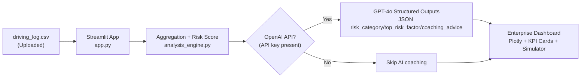

# ClearClaim: Driver Insights Pro

ClearClaim Pro is a telematics analysis dashboard that turns raw trip logs into an underwriting-friendly risk score, interactive visualizations, and AI-generated coaching advice.Additionally, for people not wishing to use AI API keys, there is a deterministic calculation process which you can visualize with some of the sample data!

It is designed to feel like an enterprise demo for insurance and mobility companies: data-dense, explainable, and fast to evaluate.

## What You Get

- **Upload + dashboard:** Upload `driving_log.csv` and view an enterprise-style dashboard (Plotly gauge + radar).
- **Personalized Risk Score (0-100):** Deterministic, explainable scoring derived from braking, speeding, and distraction.
- **AI coaching (structured JSON):** Optional GPT-powered `risk_category`, `top_risk_factor`, and `coaching_advice`.
- **Impact Simulator (what-if):** Adjust behavior improvements and see a projected premium and annual savings.

## System Architecture

**Flow (CSV → scoring → OpenAI → Streamlit):**

1. **User uploads a CSV** in the Streamlit app (`app.py`).
2. **Parsing + validation:** the app verifies required columns and coerces types.
3. **Aggregation + scoring:** trip-level signals are aggregated into driver-level stats.
   - The scoring math is deterministic and explainable (see `analysis_engine.py`).
4. **Optional OpenAI call (AI coaching):**
   - The aggregated stats are sent to the OpenAI API (`gpt-4o`).
   - The model returns **strict JSON** via Structured Outputs / JSON schema.
5. **Dashboard rendering:** Streamlit renders KPI cards, Plotly charts, the AI coaching panel, and the what-if simulator.



## Business Impact

### Insurance (Geico-style use case)

- **Fewer claims through behavior change:** Coaching makes risky behavior tangible and actionable (hard braking, speeding, distraction).
- **Faster underwriting decisions:** A single risk score with transparent drivers helps triage applicants and price policies.
- **Retention + trust:** Drivers see what improves their score, plus a “what-if” view that links safer driving to potential savings.

### Fleet / Logistics (Uber-style use case)

- **Operational safety:** Managers can identify behavioral risk patterns and coach drivers proactively.
- **Reduced incident costs and downtime:** Fewer harsh events and less night exposure can translate into fewer collisions and disruptions.
- **Driver engagement:** A clean, readable dashboard paired with clear coaching advice supports consistent improvement.

## Repository Layout

- `app.py` – Streamlit dashboard (upload, charts, AI coaching panel, impact simulator).
- `analysis_engine.py` – Aggregation + deterministic scoring + OpenAI structured JSON coaching call.
- `generate_driving_log.py` – Synthetic dataset generator for hackathon/demo data.
- `driving_log.csv` – Sample synthetic driving log dataset.
- `requirements.txt` – Python dependencies.

## Setup

This repo uses a local virtual environment (`.venv`) so installs do not conflict with system Python (common on macOS/Homebrew).

```bash
python3 -m venv .venv
.venv/bin/python -m pip install -r requirements.txt
```

## Run The Dashboard

```bash
.venv/bin/streamlit run app.py
```

Open the local URL Streamlit prints in your terminal.

## OpenAI (Optional)

AI coaching is optional. Without an API key, the dashboard still computes scores and renders charts.

Set your key:

```bash
export OPENAI_API_KEY="your_key_here"
```

Or paste it into the **OpenAI API Key** field in the sidebar.

## CSV Schema

Expected columns:

- `trip_id` (UUID)
- `duration_minutes` (float)
- `distance_miles` (float)
- `hard_braking_events` (int)
- `speeding_events` (int)
- `night_driving_minutes` (float)
- `distraction_score` (float 0.0–1.0)

## Notes / Assumptions

- The “Personalized Risk Score” uses per-trip averages for stability across different numbers of trips.
- The Impact Simulator uses a premium projection formula:
  - `NewPremium = BasePremium * (RiskScore / 100)`
  - and shows the delta vs current premium as potential annual savings.

## Opt-In Proof-of-Driving Service (Future Idea)

ClearClaim Pro can evolve from a dashboard into an **opt-in service** where drivers (or fleets) share real telematics data and receive an insurer-ready, tamper-evident “proof” report that supports discounts, safer driving incentives, or preferred access programs.

This section is a **write-up only** (no implementation yet).

### Product Concept

- **User opt-in:** Drivers explicitly consent to data collection and select which insurers/programs they want to share with.
- **Real data capture:** A mobile app or vehicle integration collects trip data (speed events, braking, phone distraction proxies, time-of-day exposure).
- **Deterministic scoring:** ClearClaim computes the risk score locally/server-side with a transparent formula (similar to this repo).
- **Attested reporting:** The service generates a structured, signed report that insurers can verify.
- **Value loop:** Users see “what to improve” and the estimated premium impact; insurers get standardized evidence and lower claims risk.

### System Architecture (High-Level)

1. **Data Capture (Mobile / Device)**
   - iOS/Android SDK capturing GPS/accelerometer + trip segmentation.
   - Optional integrations: OBD-II dongles, OEM APIs, fleet telematics providers.
2. **Ingestion + Storage (Backend)**
   - Authenticated upload endpoint receives raw telemetry + metadata (device id, app version, consent scope).
   - Store raw events and normalized “trip summaries” separately to support auditing and efficient scoring.
3. **Scoring + Analytics**
   - Deterministic scoring engine (versioned) produces a score and a breakdown by factors.
   - Aggregation windows (7/30/90 days) to align with insurer programs.
4. **Proof Report + Verification**
   - Produce a JSON report with score, breakdown, time window, and consent scope.
   - Sign reports (server-side) so insurers can verify integrity and authenticity.
5. **Partner API (Insurer / Fleet)**
   - Insurers fetch reports via API or receive webhook pushes after user approval.
   - Dashboards for program admins and fraud/risk analysts.

### Implementation Plan (Phased)

**Phase 0: Requirements + Threat Model (1–2 weeks)**
- Define what “proof” means: which metrics, what time windows, what level of auditability insurers require.
- Create a privacy-first data policy and a threat model (device spoofing, replay attacks, report tampering).

**Phase 1: MVP Data Pipeline (2–4 weeks)**
- Build a small backend with:
  - User auth (email/password or passkeys)
  - Trip upload API (`/trips:ingest`)
  - Normalization + storage (raw + summarized)
- Add a versioned deterministic scoring module (reuse the logic patterns from `analysis_engine.py`).
- Generate an offline-style structured report (like `generate_offline_risk_report`) so the system works without any LLM dependency.

**Phase 2: Consent + Sharing Workflow (2–4 weeks)**
- Implement explicit consent screens and sharing scopes:
  - what is collected
  - which partner receives it
  - retention period
- Add “share my report” flows and a revocation mechanism (stop sharing, delete, or export).

**Phase 3: Attested Reports + Partner Verification (3–6 weeks)**
- Sign reports with a server key; publish verification docs and a minimal verifier library.
- Add partner endpoints:
  - `GET /reports/{driver}/{window}`
  - webhooks for new reports after user approval
- Add fraud signals:
  - impossible speed/accel patterns
  - device integrity checks (platform attestation when available)
  - duplicate/replayed uploads

**Phase 4: Mobile App / SDK + Sensor Quality (ongoing)**
- Trip detection, background collection, battery optimization, sensor calibration.
- Robust event detection for hard braking and distraction proxies, tuned per device.

### Data Model (Suggested)

- `raw_events`: timestamped sensor samples (GPS, accel, optional gyro)
- `trip_summary`: per-trip metrics (duration, distance, braking/speeding counts, night minutes, distraction score)
- `score_result`: score + breakdown + engine version + window
- `report`: signed JSON payload + consent scope + verification metadata

### Privacy & Compliance Notes (Non-Legal)

- Minimize collection by default (only store what is needed for scoring and verification).
- Encrypt at rest + in transit, and separate identifiers from telemetry where possible.
- Make export/delete easy; track consent changes and sharing revocations.
- Be explicit about what “distraction” means (proxy signals, not content).
