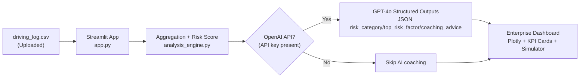

# ClearClaim: Driver Insights Pro

ClearClaim Pro is a telematics analysis dashboard that turns raw trip logs into an underwriting-friendly risk score, interactive visualizations, and AI-generated coaching advice.Additionally, for people not wishing to use AI API keys, there is a deterministic calculation process which you can visualize with some of the sample data!

It is designed to feel like an enterprise demo for insurance and mobility companies: data-dense, explainable, and fast to evaluate.

## What You Get

- **Upload + dashboard:** Upload `driving_log.csv` and view an enterprise-style dashboard (Plotly gauge + radar).
- **Personalized Risk Score (0-100):** Deterministic, explainable scoring derived from braking, speeding, and distraction.
- **AI coaching (structured JSON):** Optional GPT-powered `risk_category`, `top_risk_factor`, and `coaching_advice`.
- **Impact Simulator (what-if):** Adjust behavior improvements and see a projected premium and annual savings.

## System Architecture

**Flow (CSV → scoring → OpenAI → Streamlit):**

1. **User uploads a CSV** in the Streamlit app (`app.py`).
2. **Parsing + validation:** the app verifies required columns and coerces types.
3. **Aggregation + scoring:** trip-level signals are aggregated into driver-level stats.
   - The scoring math is deterministic and explainable (see `analysis_engine.py`).
4. **Optional OpenAI call (AI coaching):**
   - The aggregated stats are sent to the OpenAI API (`gpt-4o`).
   - The model returns **strict JSON** via Structured Outputs / JSON schema.
5. **Dashboard rendering:** Streamlit renders KPI cards, Plotly charts, the AI coaching panel, and the what-if simulator.



## Business Impact

### Insurance (Geico-style use case)

- **Fewer claims through behavior change:** Coaching makes risky behavior tangible and actionable (hard braking, speeding, distraction).
- **Faster underwriting decisions:** A single risk score with transparent drivers helps triage applicants and price policies.
- **Retention + trust:** Drivers see what improves their score, plus a “what-if” view that links safer driving to potential savings.

### Fleet / Logistics (Uber-style use case)

- **Operational safety:** Managers can identify behavioral risk patterns and coach drivers proactively.
- **Reduced incident costs and downtime:** Fewer harsh events and less night exposure can translate into fewer collisions and disruptions.
- **Driver engagement:** A clean, readable dashboard paired with clear coaching advice supports consistent improvement.

## Repository Layout

- `app.py` – Streamlit dashboard (upload, charts, AI coaching panel, impact simulator).
- `analysis_engine.py` – Aggregation + deterministic scoring + OpenAI structured JSON coaching call.
- `generate_driving_log.py` – Synthetic dataset generator for hackathon/demo data.
- `driving_log.csv` – Sample synthetic driving log dataset.
- `requirements.txt` – Python dependencies.

## Setup

This repo uses a local virtual environment (`.venv`) so installs do not conflict with system Python (common on macOS/Homebrew).

```bash
python3 -m venv .venv
.venv/bin/python -m pip install -r requirements.txt
```

## Run The Dashboard

```bash
.venv/bin/streamlit run app.py
```

Open the local URL Streamlit prints in your terminal.

## OpenAI (Optional)

AI coaching is optional. Without an API key, the dashboard still computes scores and renders charts.

Set your key:

```bash
export OPENAI_API_KEY="your_key_here"
```

Or paste it into the **OpenAI API Key** field in the sidebar.

## CSV Schema

Expected columns:

- `trip_id` (UUID)
- `duration_minutes` (float)
- `distance_miles` (float)
- `hard_braking_events` (int)
- `speeding_events` (int)
- `night_driving_minutes` (float)
- `distraction_score` (float 0.0–1.0)

## Notes / Assumptions

- The “Personalized Risk Score” uses per-trip averages for stability across different numbers of trips.
- The Impact Simulator uses a premium projection formula:
  - `NewPremium = BasePremium * (RiskScore / 100)`
  - and shows the delta vs current premium as potential annual savings.

